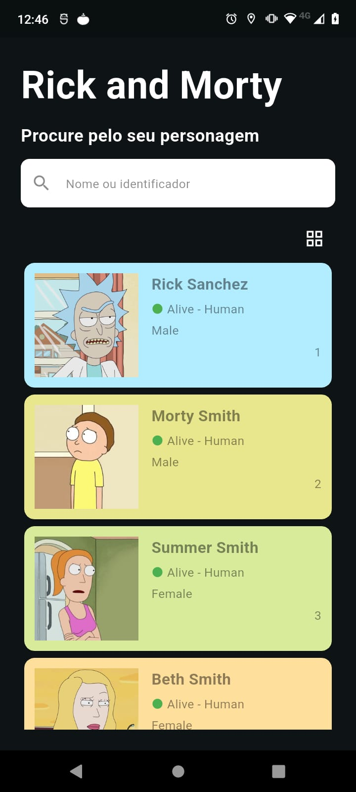
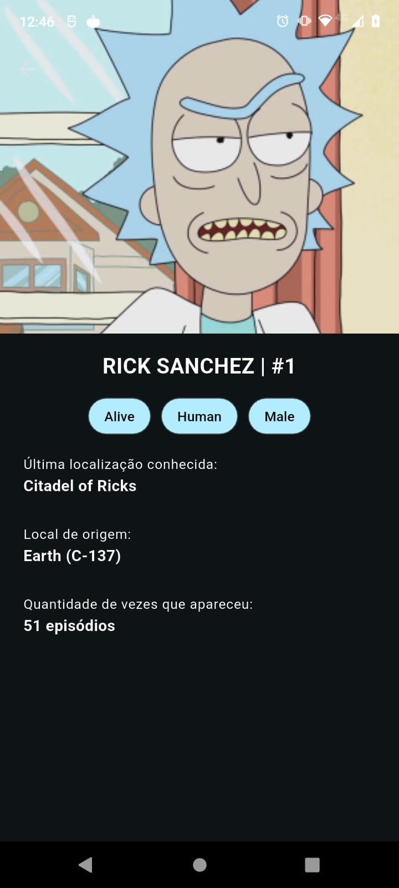

# 📱 App Rick and Morty

> App Rick and Morty é uma app mobile desenvolvida para explorar o universo da série, permitindo a visualização detalhada de personagens com uma interface fluida e moderna. O projeto foi concebido para colocar em prática conceitos avançados de consumo de API e arquitetura escalável no Flutter.

[](https://flutter.dev/)
[](https://dart.dev/)

---

## 📸 Demonstração Visual

<p align="center">
  
  
</p>

## 📱 Mapeamento de Telas

- **Home:** (Dashboard de Personagens)
  - Campo de pesquisa que permite buscar os personagens por nome ou pelo id.
  - Botão para alternar entre tipos de visualização entre Grid ou List.
  - Apresentação dos personagens com requisição a mais caso chegue ao fim do scroll.
- **Detalhes:** (Detalhes de cada Personagem)
  - Página com mais detalhes do personagem clicado na na página Home.

## ✨ Funcionalidades

- **Visualização Flexível:** A página inicial permite alternar dinamicamente entre o layout em Lista e em Grade.
- **Busca e Filtro Local:** Campo de pesquisa na tela inicial que filtra instantaneamente os personagens já carregados, permitindo buscas tanto pelo Nome quanto pelo ID.
- **Detalhes do Personagem:** Navegação para uma tela dedicada com informações completas ao tocar em qualquer personagem da lista.
- **Paginação Inteligente (Infinite Scroll):** Consumo da API sob demanda. O app carrega os dados de 20 em 20, buscando novos personagens automaticamente apenas quando o usuário chega ao final da rolagem.
- **UI Adaptativa (Cores Dinâmicas):** O fundo dos cards (tanto na lista quanto na grade) muda automaticamente para combinar com a cor predominante da imagem de cada personagem.

## 🧠 Decisões de Desenvolvimento

Neste projeto, apliquei uma abordagem sistemática para garantir que o código fosse modular, testável e fácil de manter. Abaixo estão as principais decisões de design:

- **MVVM + Service Layer:** Estrutura adotada para garantir o desacoplamento entre a interface e a lógica de dados. O uso de uma camada de Service dedicada permite o mapeamento rigoroso dos dados da API antes de serem entregues à ViewModel.

- **Pacote cached_network_image:** Implementei para uma estratégia de cache local. Isso melhora a performance do app e a experiência do usuário, evitando requisições de rede desnecessárias para imagens já visualizadas.

## 🛠️ Tecnologias e Arquitetura

Este projeto foi desenvolvido com as seguintes tecnologias e práticas:

- **Linguagem:** [Dart](https://dart.dev/)
- **Framework:** [Flutter](https://flutter.dev/)
- **Gerenciamento de Estado:** [Mobx](https://pub.dev/packages/mobx)
- **Consumo de API:** [Dio](https://pub.dev/packages/dio)
- **Arquitetura:** MVVM + Service Layer

## 🚀 Como Executar o Projeto

**Pré-requisitos**

Certifique-se de ter instalado em sua máquina:

- [Git](https://git-scm.com)
- [Flutter SDK](https://docs.flutter.dev/get-started/install)
- Um emulador (Android/iOS) ou dispositivo físico devidamente configurado.

**Passo a passo**

1. Faça o clone deste repositório:

```bash
git clone https://github.com/JhonnyAraujo/app-rick-and-morty.git
```

2. Acesse o diretório do projeto:

```bash
cd nome-do-repositorio
```

3. Instale as dependências do pacote:

```bash
flutter pub get
```

4. Gere os arquivos de estado do MobX (`.g.dart`):

```bash
dart run build_runner build --delete-conflicting-outputs
```

5. Execute o aplicativo:

```bash
flutter run
```
